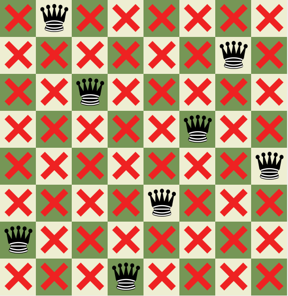

[![Contributors][contributors-shield]][contributors-url]
[![Forks][forks-shield]][forks-url]
[![Stargazers][stars-shield]][stars-url]
[![Issues][issues-shield]][issues-url]
[![MIT License][license-shield]][license-url]
[![LinkedIn][linkedin-shield]][linkedin-url]

<!-- PROJECT LOGO -->
 

  

<h3 align="center">Queens Problem</h3>

  

    A queens problem solver
     
    <a href="https://github.com/chrkj/QueensProblem"><strong>Explore the docs »</strong></a>
     
     
    <a href="https://github.com/chrkj/QueensProblem/issues">Report Bug</a>
    ·
    <a href="https://github.com/chrkj/QueensProblem/issues">Request Feature</a>
  

<!-- ABOUT THE PROJECT -->
## About The Project
The queen problem is the problem of placing eight chess queens on an 8x8 chessboard so that no two queens threaten each other.
There are 92 solutions. This application utilises a binary decision diagram (BDD) to determine where it is possible to place a queen
according to the current state of the board. The application also supports a path counter which displays the current number of solutions
to the board state.

(<a href="#top">back to top</a>)

### Built With

Frameworks/libraries used for the project:

* [JavaBDD](https://github.com/com-github-javabdd/com.github.javabdd)

(<a href="#top">back to top</a>)

<!-- LICENSE -->
## License

Distributed under the MIT License. See `LICENSE.txt` for more information.

(<a href="#top">back to top</a>)

<!-- MARKDOWN LINKS & IMAGES -->
[contributors-shield]: https://img.shields.io/github/contributors/chrkj/QueensProblem.svg?style=for-the-badge
[contributors-url]: https://github.com/chrkj/QueensProblem/graphs/contributors

[forks-shield]: https://img.shields.io/github/forks/chrkj/QueensProblem.svg?style=for-the-badge
[forks-url]: https://github.com/chrkj/QueensProblem/network/members

[stars-shield]: https://img.shields.io/github/stars/chrkj/QueensProblem.svg?style=for-the-badge
[stars-url]: https://github.com/chrkj/QueensProblem/stargazers

[issues-shield]: https://img.shields.io/github/issues/chrkj/QueensProblem.svg?style=for-the-badge
[issues-url]: https://github.com/chrkj/QueensProblem/issues

[license-shield]: https://img.shields.io/github/license/chrkj/QueensProblem.svg?style=for-the-badge&
[license-url]: https://github.com/chrkj/QueensProblem/blob/master/LICENSE

[linkedin-shield]: https://img.shields.io/badge/-LinkedIn-black.svg?style=for-the-badge&logo=linkedin&colorB=555
[linkedin-url]: https://www.linkedin.com/in/christian-kjaer/

